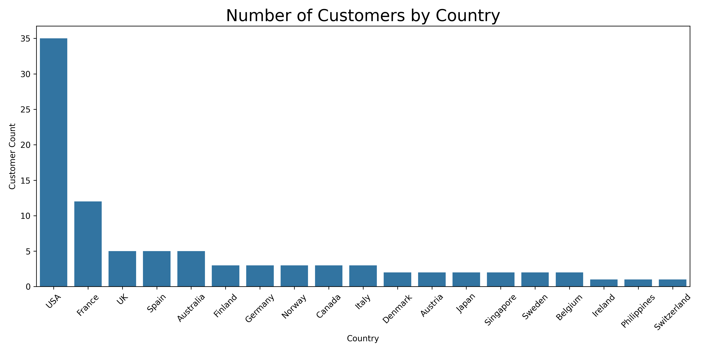
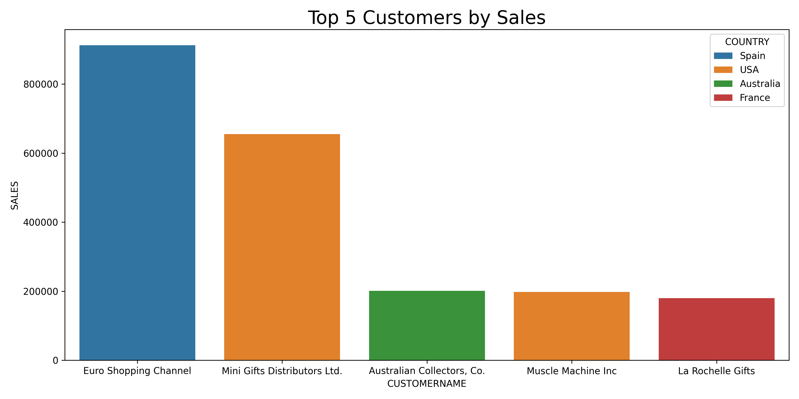
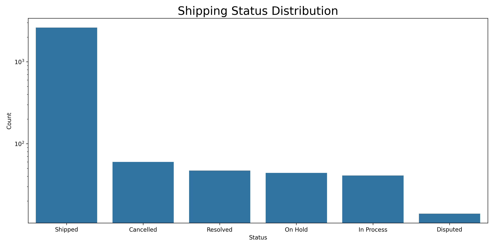
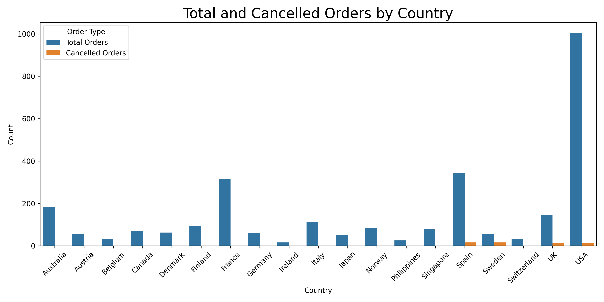
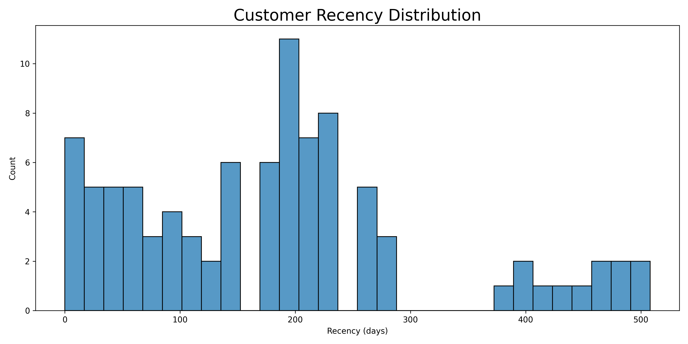
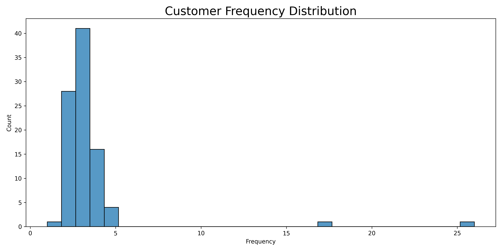
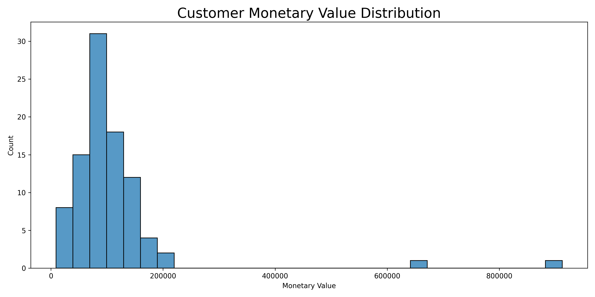
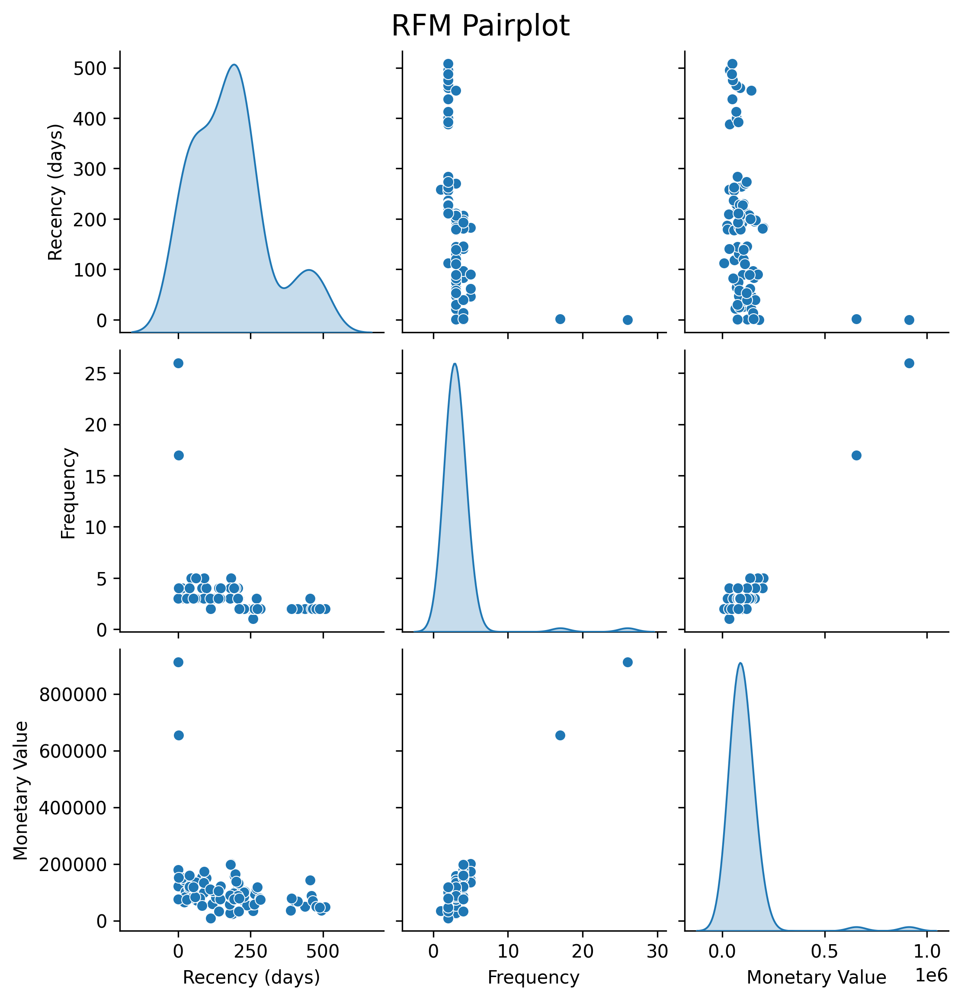

# Sales Data Analysis & RFM Segmentation

This repository showcases an end-to-end analysis of a **sales dataset**, highlighting key insights such as revenue by country, top customers, shipping status, cancellations, and a Recency-Frequency-Monetary (RFM) segmentation.

--

## Table of Contents
1. [Overview](#overview)
2. [Insights](#insights)
   - [Total Sales by Country](#total-sales-by-country)
   - [Customers by Country](#customers-by-country)
   - [Top Customers by Sales](#top-customers-by-sales)
   - [Shipping Status Distribution](#shipping-status-distribution)
   - [Cancelled vs Total Orders by Country](#cancelled-vs-total-orders-by-country)
   - [RFM Segmentation & Visualizations](#rfm-segmentation--visualizations)
3. [Final Insights](#final-insights)

---

## Overview

This project aims to derive actionable business insights from a sample sales dataset using Python libraries such as **pandas**, **seaborn**, and **matplotlib**. Visualizations and metrics help guide decisions in areas like market targeting, customer retention, and operational improvements.

---

## Insights

### Total Sales by Country
> **What it shows**: Identifies which countries generate the highest revenue, providing direction on key markets or expansion opportunities.

- The company primarily sells in the **USA and Europe**, with some presence in **Australia and Singapore**.
- Although the **USA generates the highest revenue**, the **average sales per company** in the USA is lower than in other countries.
- **Recommendation**: Focus on **increasing average sales per company** in the USA.

---

### Customers by Country
> **What it shows**: Shows the unique number of customers in each country, revealing areas with strong customer bases and potential for growth.

- The **USA and Europe** have the highest number of customers.
- **Recommendation**: Identify potential **growth opportunities** in underperforming regions.

---

### Top Customers by Sales
> **What it shows**: Pinpoints the highest-revenue customers, supporting targeted relationship management and retention strategies.

- A small number of customers contribute to a significant portion of total sales.
- **Recommendation**: Implement **loyalty programs** or **personalized offers** to retain top customers.

---

### Shipping Status Distribution
> **What it shows**: Breaks down order statuses (e.g., Shipped, Cancelled, On Hold), offering insights into operational performance and fulfillment efficiency.

- Most orders are **successfully shipped**, but some **delays and cancellations** exist.
- **Recommendation**: Improve **order tracking** and reduce shipping inefficiencies.

---

### Cancelled vs Total Orders by Country
> **What it shows**: Compares cancellation rates across countries to highlight where process improvements or further investigation might be needed.

- **Sweden and the UK** have a higher-than-average cancellation rate.
- **Recommendation**: Investigate the **reasons for cancellations** in these countries and address customer concerns.

---

### RFM Segmentation & Visualizations
> **What it shows**:
> - **Recency** (days since last purchase)
> - **Frequency** (number of unique orders)
> - **Monetary** (total sales)

These metrics are combined into an **RFM DataFrame** and visualized to guide loyalty campaigns, personalization, and retention.

#### Recency Distribution

- **Most customers haven't purchased recently**, highlighting a need for **reactivation campaigns**.

#### Frequency Distribution

- A **small percentage of customers** make repeated purchases.
- **Recommendation**: Encourage repeat purchases with **discounts and email marketing**.

#### Monetary Distribution

- A **few high-value customers** contribute significantly to total sales.
- **Recommendation**: Prioritize **high-value customers** for VIP programs and premium services.

#### RFM Pairplot

- Displays correlations between **Recency, Frequency, and Monetary value**.

---

## Final Insights

### 1. **Sales by Country**
- The company mainly sells in the **USA and Europe**, with some presence in **Australia and Singapore**.
- Even though the **USA is the largest market**, the **average sales per company** in the USA is **lower** than in other countries.
- **Recommendation**: Focus on **increasing the average sales per company** in the USA.

### 2. **Sales by Year and Quarter**
- There is a **positive trend** in sales from **2003 to 2005**, but nearly **50% of total sales occur in Q4** due to the holiday season.
- While high Q4 sales are expected due to holiday shopping, the company should **increase sales in other quarters** to maintain a more stable revenue stream.
- **Recommendation**: Introduce **seasonal promotions, discounts, and marketing campaigns** in Q1–Q3.

### 3. **Cancelled Orders**
- A **small percentage** of total orders are cancelled, which is expected in any business.
- However, **Sweden and the UK** have a **higher-than-average cancellation rate**.
- **Recommendation**:
   - Investigate **why** these orders are being cancelled in specific countries.
   - Improve **customer support, logistics, and order fulfillment** processes in those regions.
   - Potentially **introduce stricter order confirmation or loyalty incentives** to reduce cancellations.
  